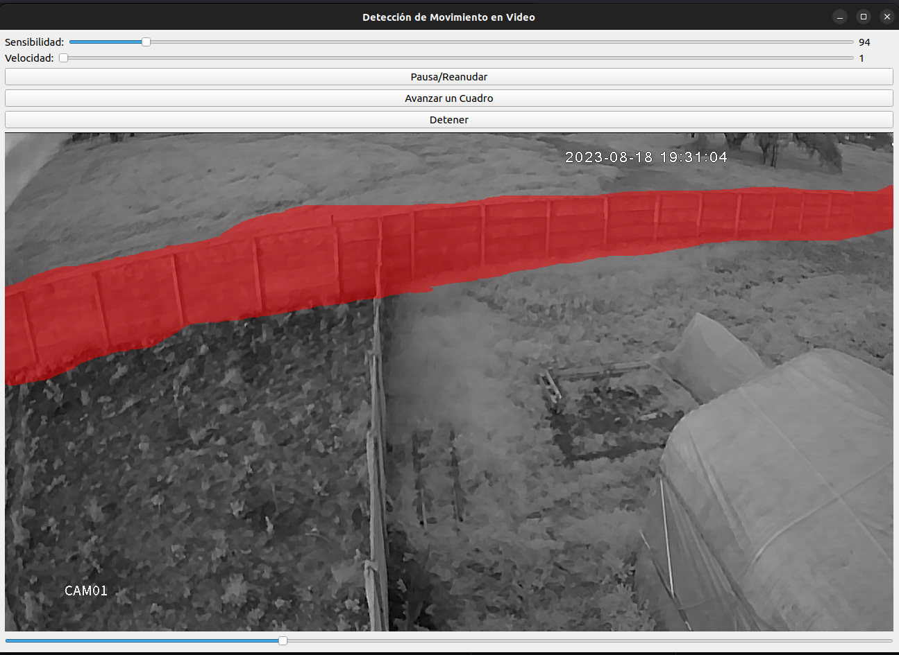

Pequeña herramienta de python para revisar videos de seguridad colocando un marco de revision

con sensibilidad y velocidad ajustables

ejecutar antes de para instalar los paquetes de python

```
pip install opencv-python numpy PyQt5
```

ejemplo de uso
```
python detecion.py archivo_de_video.mp4 81
```
la sensibilidad es el ultimo parametro.



unir los mp4 en uno y o convertir de otros formatos en mp4 con el fin de no estar analizando uno a uno.
tener en cuenta que se debe ejecutar en la carpeta
```
ffmpeg -f concat -safe 0 -i <(for f in *.mp4; do echo "file '$PWD/$f'"; done) -c copy output.mp4
```

fuciono muy bien con un video de 7 Gigas eran 3 dias seguidos.


